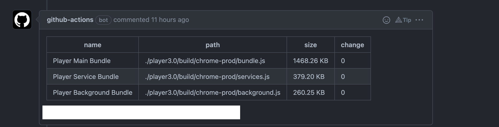

# Bundle watch

```cmd
    - name: Bundle watch for Player
      uses: saiumesh535/bundle-watch-action@master
      id: bundlewatch
      with:
        BRANCH_NAME: ${{needs.rules.outputs.branch_name}}
        BUCKET_NAME: "apty-bundle-watch/apty-assist"
        REGION: "us-east-1"
        CONFIG_PATH: <path-to-config-file>
        TARGET_BRANCH: ${{github.event.pull_request.base.ref}}
      env:
        AWS_ACCESS_KEY_ID: ${{ secrets.AWS_ACCESS_KEY_ID }}
        AWS_SECRET_ACCESS_KEY: ${{ secrets.AWS_SECRET_ACCESS_KEY }}
```

The above action return a output `comment` which is a `markdown` table for bundle size. this can be used to comment on your PR as below

```cmd
    - uses: actions/github-script@0.9.0
      env:
        PLAN: "${{ steps.bundlewatch.outputs.comment }}"
      with:
        github-token: ${{ secrets.GITHUB_TOKEN }}
        script: |
          const output = `${process.env.PLAN}
          *Pusher: @${{ github.actor }}, Action: \`${{ github.event_name }}\`*`;
          github.issues.createComment({
            issue_number: context.issue.number,
            owner: context.repo.owner,
            repo: context.repo.repo,
            body: output
          })
```

## Config file

Config file as follows

```js
[
  {
      "name": "Name of the bundle",
      "path": "./build/bundle.js"
  },
  {
      "name": "Another bundle",
      "path": "./build/vendor.js"
  }
]

```

## Sample screenshot


